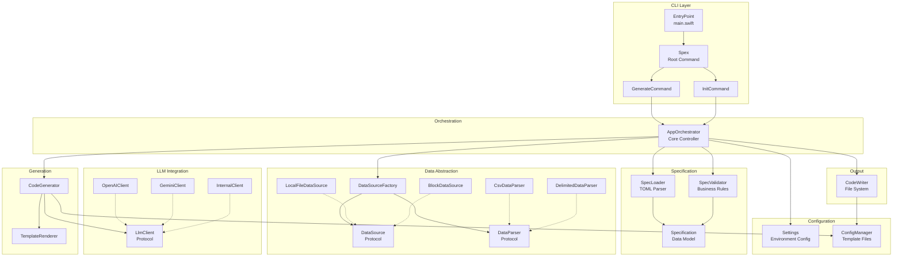
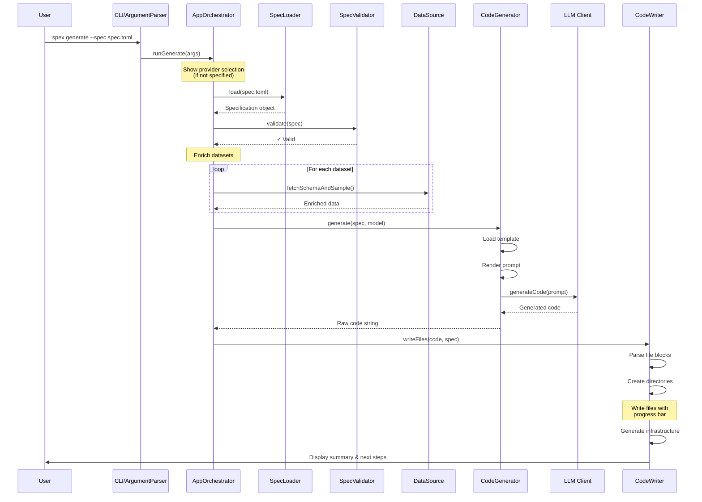

# Architecture

## Overview

spex is a Swift-based command-line tool that accelerates data science and analytics engineering workflows through AI-powered code generation. It follows a "spec-driven" philosophy: users define *what* they want to analyze in a simple TOML configuration file, and spex generates *how* to do it—producing complete, production-ready, tested code pipelines.

**Primary Goal**: Automate the boilerplate and repetitive aspects of setting up data analysis projects, allowing data professionals to focus on business logic and insights rather than infrastructure.

## Core Concepts

### Spec-Driven Generation
The entire system revolves around a `spec.toml` file that serves as the single source of truth. This declarative approach allows users to describe their analysis requirements without worrying about implementation details:

```toml
language = "pyspark"
analysis_type = "Page Performance Attribution"
description = "Analyzes app events to measure page performance"

[[dataset]]
name = "app_events"
description = "User interaction events"
sample_data_block = """
user_id,page_id,event_type,timestamp
user_001,home_page,impression,2025-01-15T10:00:00Z
"""
```

### Multi-Provider LLM Support
spex abstracts LLM interactions through a protocol-oriented design, supporting multiple providers (OpenAI, Google Gemini, internal gateways) with a unified interface. This flexibility allows organizations to use their preferred LLM or switch providers without changing their workflow.

### Language-Specific Scaffolding
The tool generates tailored project structures for different target languages:
- **Python**: Data science pipelines with pandas, visualizations, and Streamlit dashboards
- **PySpark**: Distributed computing pipelines with proper Spark patterns
- **SQL**: dbt-based analytics engineering projects

Each language gets appropriate tooling, dependency management, and best practices baked in.

### Rich Developer Experience
spex prioritizes user experience with:
- Interactive prompts for guided setup
- Real-time progress indicators for long operations  
- Colorized output and formatted tables
- Clear error messages with actionable solutions

## System Components



### CLI Layer (EntryPoint & Commands)

**EntryPoint**: The application's main entry point that:
- Sets up the environment (loads `.env` files)
- Handles special cases (interactive mode when no arguments provided)
- Delegates to ArgumentParser for command parsing
- Provides top-level error handling with user-friendly messages

**Command Structure**:
- `Spex`: Root command using swift-argument-parser
- `GenerateCommand`: Handles `spex generate --spec path/to/spec.toml`
- `InitCommand`: Handles `spex init` to create a starter spec file

### Orchestration (AppOrchestrator)

The central `actor` that coordinates the entire workflow. Key responsibilities:
- Manages the complete lifecycle of command execution
- Integrates with Noora for interactive prompts and progress indicators
- Orchestrates the pipeline: load → validate → enrich → generate → write
- Provides both programmatic (`runGenerate`) and interactive (`runInteractive`) modes

### Configuration Layer

**Settings**: Simple struct that loads configuration from environment variables:
- API keys for different LLM providers
- Base URLs for API endpoints  
- Default models for each provider

**ConfigManager**: Manages embedded resource files:
- Locates and reads template files from the `configs/` directory
- Provides language-specific Makefiles, READMEs, and configuration files
- Handles project scaffolding templates

### Specification Handling

**Specification**: The core data model representing the user's analysis requirements:
- Codable struct that maps directly to `spec.toml` structure
- Contains datasets, metrics, output specifications
- Supports both file paths and inline data blocks

**SpecLoader**: Responsible for loading specifications:
- Reads TOML files from disk
- Decodes into Specification objects
- Provides helpful error messages for common issues (missing data, commented fields)

**SpecValidator**: Enforces business rules:
- Validates field lengths and content
- Ensures language is supported
- Checks for required fields

### Data Source Abstraction

This subsystem uses the **Strategy Pattern** to handle different data formats:

**Protocols**:
- `DataSource`: Contract for fetching data (`fetchSchemaAndSample`)
- `DataParser`: Contract for parsing raw strings into structured data

**Implementations**:
- `LocalFileDataSource`: Reads from filesystem, delegates parsing
- `BlockDataSource`: Returns inline data blocks as-is
- `CsvDataParser`: Parses CSV format using SwiftCSV
- `DelimitedDataParser`: Handles space/tab-delimited data
- `SparkAsciiDataParser`: Parses Spark-style ASCII tables

**DataSourceFactory**: Composition root that:
- Determines appropriate DataSource based on spec
- Injects correct parser based on file extension
- Returns composed objects ready for use

### LLM Client Abstraction

Another **Strategy Pattern** implementation for LLM providers:

**LlmClient Protocol**: Single method `generateCode(prompt:model:)`

**Concrete Implementations**:
- `OpenAIClient`: Handles OpenAI API communication
- `GeminiClient`: Handles Google Gemini API  
- `InternalClient`: Proxy for internal LLM gateways

This design makes adding new providers trivial—just implement the protocol.

### Generation Engine

**CodeGenerator**: Orchestrates the code generation process:
- Loads language-specific prompt templates
- Converts Specification to template context
- Delegates to TemplateRenderer for prompt creation
- Sends final prompt to LLM client

**TemplateRenderer**: Simple but effective template engine:
- Supports variable substitution: `{{ spec.language }}`
- Handles for-loops for iterating over datasets/metrics
- Provides dot-notation access to nested properties

### Output Layer (CodeWriter)

Handles all file system operations:
- Parses LLM output into individual file blocks
- Creates timestamped project directories
- Writes code files with progress indication
- Generates supporting files (README, Makefile, .gitignore)
- Prints formatted summary tables
- Provides clear "next steps" guidance

## Data Flow

The following sequence diagram illustrates the complete flow for the `generate` command:



### Detailed Steps:

1. **User Execution**: User runs `spex generate --spec path/to/spec.toml`

2. **Command Parsing**: ArgumentParser validates arguments and creates command structure

3. **Orchestration Begins**: `AppOrchestrator.runGenerate` takes control

4. **Provider Selection**: If `--provider` wasn't specified, Noora presents an interactive menu

5. **Load & Validate**: 
   - SpecLoader reads and decodes the TOML file
   - SpecValidator checks business rules
   - Helpful errors guide users to fix issues

6. **Data Enrichment**:
   - DataSourceFactory creates appropriate source/parser combinations
   - Sample data is fetched and formatted for each dataset
   - The Specification is enriched with actual data samples

7. **Code Generation**:
   - CodeGenerator loads the language-specific prompt template
   - TemplateRenderer injects the specification data
   - The composed prompt is sent to the selected LLM

8. **File Writing**:
   - CodeWriter parses the LLM response into file blocks
   - Creates timestamped project directory structure
   - Writes each file with progress indication
   - Generates supporting infrastructure files

9. **Summary Display**: 
   - Formatted table shows generated files
   - Clear next steps guide the user
   - Project location is highlighted

## Design Principles

### Protocol-Oriented Design
Key abstractions are defined as protocols (`LlmClient`, `DataSource`, `DataParser`), enabling:
- Easy testing with mock implementations
- Seamless addition of new providers/formats
- Clear contracts between components
- Dependency injection for flexibility

### Separation of Concerns
Each component has a single, well-defined responsibility:
- `SpecLoader` only loads specifications
- `CodeWriter` only handles file operations
- `DataParser` only parses data formats

This makes the codebase modular, testable, and maintainable.

### Composition Over Inheritance
The system favors object composition:
- `LocalFileDataSource` is composed with a `DataParser`
- `DataSourceFactory` composes the right combinations
- No complex inheritance hierarchies

### Configuration as Code
The `spec.toml` file serves as a declarative, version-controllable representation of analysis requirements. Users describe the "what," and spex handles the "how."

### User-Centric CLI Design
Every interaction is designed for developer happiness:
- **Noora integration**: Smooth prompts and progress indicators
- **Helpful errors**: Clear messages with actionable solutions
- **Visual feedback**: Colors, tables, and formatting
- **Smart defaults**: Working examples out of the box

## Directory Structure

```
Sources/Spex/
├── App/
│   └── AppOrchestrator.swift      # Central orchestration logic
├── CLI/
│   ├── Arguments.swift            # Argument definitions
│   └── Commands.swift             # Command implementations
├── Configuration/
│   ├── ConfigManager.swift        # Template file management
│   └── Settings.swift             # Environment configuration
├── DataInterfaces/
│   ├── DataSourceFactory.swift    # Composition root
│   ├── LocalFileDataSource.swift  # File-based data
│   └── BlockDataSource.swift      # Inline data blocks
├── Error/
│   └── AppError.swift            # Application error types
├── Generation/
│   └── CodeGenerator.swift       # Code generation orchestration
├── Models/
│   ├── Specification.swift       # Core data model
│   └── CliEnums.swift           # CLI-related enums
├── Networking/
│   ├── OpenAIClient.swift       # OpenAI integration
│   ├── GeminiClient.swift       # Gemini integration
│   └── InternalClient.swift     # Internal gateway proxy
├── Parsing/
│   ├── CsvDataParser.swift      # CSV parsing
│   └── DelimitedDataParser.swift # Delimited text parsing
├── Protocols/
│   ├── DataSource.swift         # Data source contract
│   ├── DataParser.swift         # Parser contract
│   └── LlmClient.swift          # LLM client contract
├── Services/
│   ├── SpecLoader.swift         # Specification loading
│   └── SpecValidator.swift      # Validation logic
├── UI/
│   ├── Banner.swift             # ASCII art banner
│   └── Logger.swift             # Colored logging
├── Writing/
│   ├── CodeWriter.swift         # File system operations
│   └── TemplateRenderer.swift   # Template engine
└── EntryPoint.swift             # Application entry

configs/
├── pyspark/
│   ├── prompt_templates/        # PySpark prompts
│   ├── Makefile.template        # PySpark Makefile
│   └── environment.yml          # Conda environment
├── python/
│   └── ...                      # Python-specific files
└── shared/
    ├── README.md.template       # Shared README
    └── gitignore.template       # Shared .gitignore
```

This structure reflects the architectural principles: clear separation of concerns, protocol-oriented design, and a focus on maintainability and extensibility.