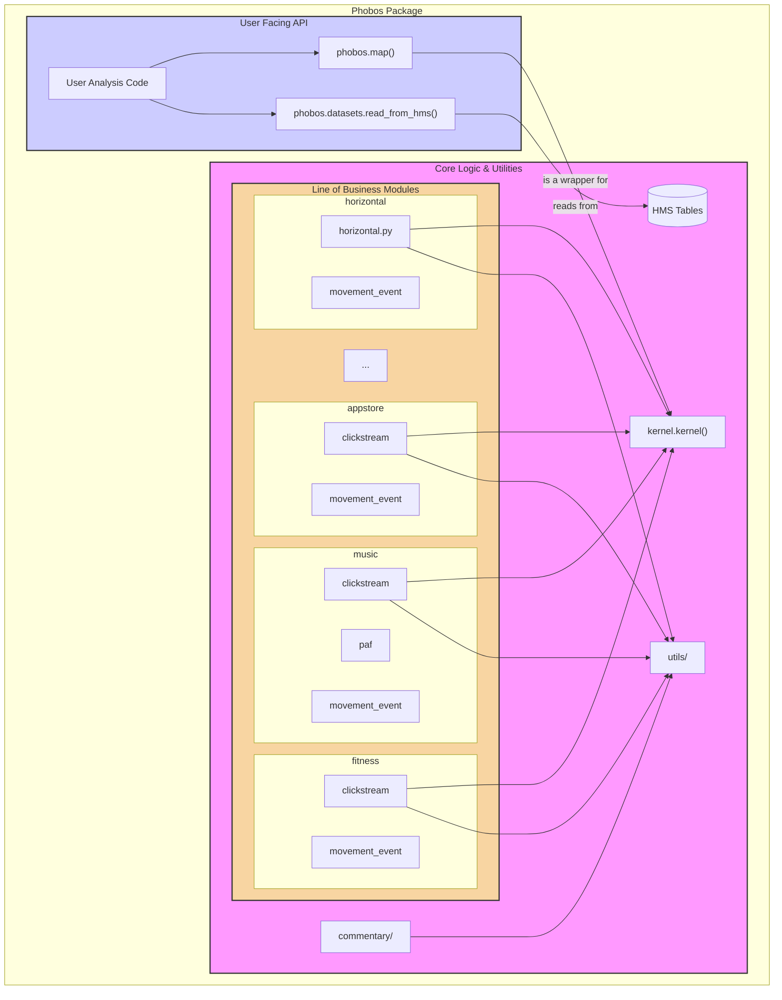

My doc:

```mermaid
graph TD
    %% ---------- Top-level package ----------
    subgraph phobos["Phobos Package"]
        direction LR

        %% ---------- API ----------
        subgraph api["User Facing API"]
            direction TB
            A[User Analysis Code] --> phobos_map["phobos.map()"]
            A --> phobos_datasets["phobos.datasets.read_from_hms()"]
        end

        %% ---------- Core ----------
        subgraph core["Core Logic & Utilities"]
            direction TB
            phobos_map -- "is a wrapper for" --> kernel["kernel.kernel()"]
            phobos_datasets -- "reads from" --> B[(HMS Tables)]

            %% ---------- LOB Modules ----------
            subgraph lob["Line of Business Modules"]
                direction TB

                subgraph appstore
                    direction TB
                    as_clickstream[clickstream]
                    as_movement[movement_event]
                end

                subgraph music
                    direction TB
                    m_clickstream[clickstream]
                    m_paf[paf]
                    m_movement[movement_event]
                end

                subgraph fitness
                    direction TB
                    f_clickstream[clickstream]
                    f_movement[movement_event]
                end

                subgraph horizontal
                    direction TB
                    h_main[horizontal.py]
                    h_movement[movement_event]
                end

                other_lobs[...]
            end

            utils[utils/]
            commentary[commentary/]
        end
    end

    %% ---------- Dependencies ----------
    as_clickstream --> kernel
    m_clickstream --> kernel
    f_clickstream --> kernel
    h_main --> kernel

    as_clickstream --> utils
    m_clickstream --> utils
    f_clickstream --> utils
    h_main --> utils
    commentary --> utils

    %% ---------- Styling ----------
    %% Option A: direct style
    style core fill:#f9f,stroke:#333,stroke-width:2px
    style api fill:#ccf,stroke:#333,stroke-width:2px
    style lob fill:#f8d5a2,stroke:#333,stroke-width:2px

    %% Option B (comment A out if you use this): classes
    %% classDef grpCore fill:#f9f,stroke:#333,stroke-width:2px;
    %% classDef grpAPI fill:#ccf,stroke:#333,stroke-width:2px;
    %% classDef grpLOB fill:#f8d5a2,stroke:#333,stroke-width:2px;
    %% class core grpCore
    %% class api grpAPI
    %% class lob grpLOB
```