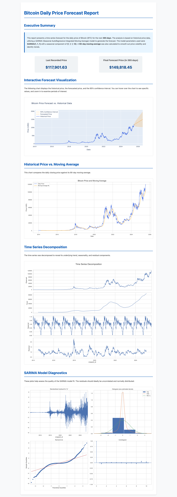

# Stock Volatility Analysis

This example demonstrates how to use `specds` to generate a Python-based analytics pipeline for calculating stock price volatility using historical market data.

It automatically creates an analysis like below in one-shot:



## Objective

The goal is to analyze historical daily stock price data to calculate daily return volatility, which is a key metric for risk assessment and portfolio management. The analysis computes daily percentage changes and measures their standard deviation.

## Prerequisites

1. The `specds` CLI must be installed and available in your system's PATH.
2. This example uses this sample data file:
   - `examples/finance/sample_data.csv` - Historical daily stock price data
3. You must have a `spec.toml` file that defines the analysis and points to the data file.

## Sample Data Overview

**Stock Prices (`sample_data.csv`):**
- `date`: Trading date
- `open`: Opening price for the day
- `high`: Highest price during the day
- `low`: Lowest price during the day
- `close`: Closing price for the day
- `volume`: Number of shares traded

The sample data contains one week of stock price data, providing sufficient information for volatility calculations.

## Instructions

This example uses Python generation with pandas for financial data analysis workflows.

1. **Organize Your Files:** Place the `.csv` file and the `spec.toml` file in the `examples/finance/` directory.

2. **Run the Generator:** From your terminal, execute the `generate` command, pointing it to your specification file using the `--spec` flag.

```bash
specds generate --spec examples/finance/spec.toml
```

## Output

After running the command, `specds` will create a new directory inside `generated_jobs/` containing a complete Python financial analytics project:

```
generated_jobs/
└── python/
    └── stock-volatility-calculation/
        └── 20250720-193000__calculates-the-daily-return-volatility-for-a-stoc/
            ├── job.py
            ├── functions.py
            ├── tests/
            │   ├── test_job.py
            │   └── test_functions.py
            └── README.md
```

## Expected Results

The analysis will produce volatility metrics including:
- **Daily Returns:** Percentage change in closing price from day to day
- **Volatility (Standard Deviation):** Measure of price movement variability
- **Risk Metrics:** Statistical measures for portfolio risk assessment

## Financial Concepts

**Daily Return Calculation:**
```
Daily Return = (Close_today - Close_yesterday) / Close_yesterday * 100
```

**Volatility Calculation:**
```
Volatility = Standard Deviation of Daily Returns
```

## Use Cases

This type of analysis is essential for:
- **Risk Management:** Measuring investment risk levels
- **Portfolio Optimization:** Balancing risk and return
- **Trading Strategies:** Understanding price movement patterns
- **Compliance Reporting:** Meeting regulatory risk disclosure requirements
- **Investment Research:** Comparing relative risk across securities